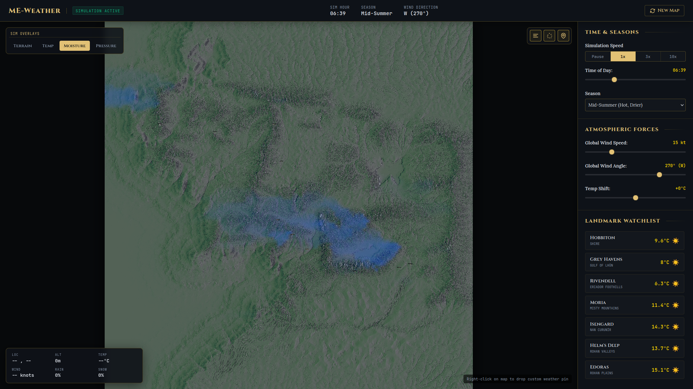

# Middle-earth Weather Simulator (ME-Weather)

An interactive, browser-based gridded weather simulator of Middle-earth, driven by a grayscale terrain heightmap. It simulates thermodynamic and fluid dynamic interactions across a 128x128 grid in real-time, mapping dynamic wind flows, precipitation, temperature variations, and moisture indices.



---

## ✨ Features

*   **Custom Heightmap Support:** Drag-and-drop any grayscale heightmap directly into the browser to initialize the terrain layout. White pixels represent mountain ranges (e.g. Misty Mountains) and black pixels represent sea level.
*   **Mythic Dark Theme:** A premium fantasy cartography meets science-telemetry aesthetic featuring slate-gray panels, warm gold accents, and fluid visual particles.
*   **Physics-Driven Climate:**
    *   **Thermodynamics:** Base season temperatures combined with latitude shifts, solar day/night heating cycles, and altitude lapse rate cooling.
    *   **Fluid Dynamics:** Wind fields accelerated by local pressure gradients, deflected by the Coriolis effect, and blocked or steered around mountain ridges.
    *   **Orographic Precipitation:** Damp sea winds rise over mountain slopes, forcing condensation and heavy rain or snow, leaving dry rain-shadow basins on the leeward side.
    *   **Precipitation Phases:** Local freezing thresholds determine whether storm cells drop falling rain streaks or drifting snow particles.
*   **Interactive Controls & Visual Overlays:**
    *   **Overlays:** Toggle between visual representations of Terrain relief, Temperature heatmaps, Moisture/Humidity indexes, and isobaric Pressure fields.
    *   **Weather Effects:** Toggle wind flow streamlines, rain/snow particles, and location markers.
    *   **Hover Inspector:** Telemetry HUD displaying coordinates, altitude, temperature, wind speed/direction, and precipitation probability.
    *   **Interactive Landmarks:** Monitor pre-configured landmarks (Hobbiton, Rivendell, Minas Tirith, Mount Doom, Helm's Deep) and right-click to place custom weather stations that persist via LocalStorage.

---

## 🛠️ Technology Stack

*   **Vite** — Fast, modern frontend bundling and hot module replacement.
*   **Vanilla JavaScript (ES6)** — Modular architecture split across physics solver, canvas rendering, and DOM UI controller.
*   **HTML5 Canvas** — Colorized relief-mapping, Lambertian hillshading shadows, vector flow particle animations, and weather particle systems.
*   **CSS3** — Custom design tokens, glassmorphism filters, responsive grid layouts, and custom-styled sliders.

---

## 🚀 Getting Started

### Prerequisites

Ensure you have [Node.js](https://nodejs.org/) installed (v18 or higher recommended).

### Installation & Run

1.  Clone or download this repository.
2.  Navigate to the project directory:
    ```bash
    cd me-weather
    ```
3.  Install dependencies:
    ```bash
    npm install
    ```
4.  Launch the development server:
    ```bash
    npm run dev
    ```
5.  Open your browser and navigate to the address displayed in the terminal (usually `http://localhost:5173`).
6.  Drag and drop your heightmap image onto the landing card to begin the simulation!

### Production Build

To compile a minified production bundle in the `dist/` directory:

```bash
npm run build
```

To preview the production build locally:

```bash
npm run preview
```
