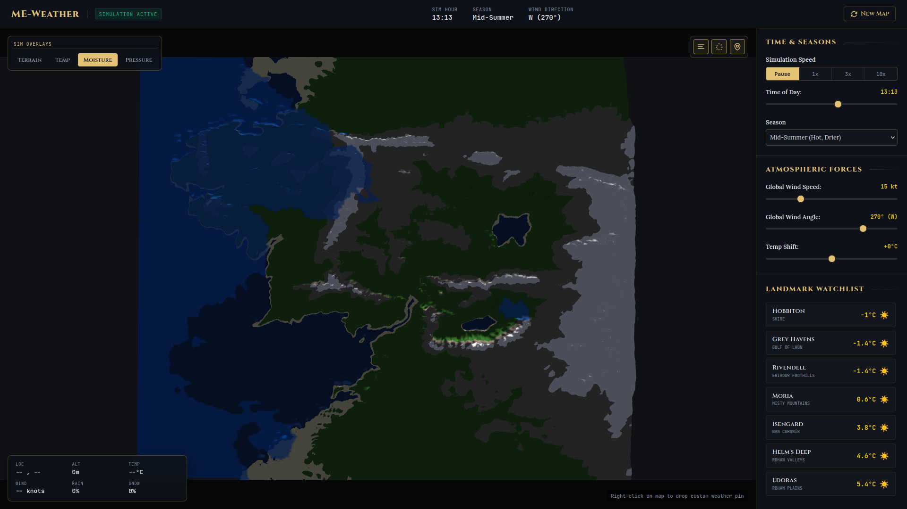

# Middle-earth Weather Simulator (me-weather)

An interactive, GPU-accelerated client-server weather simulator of Middle-earth. It simulates thermodynamics, fluid dynamics, and terrain-climate interactions across massive high-resolution grids in real-time, delivering dynamic wind flows, precipitation, temperature variations, and moisture indices.



---

## ✨ Features

*   **Server-Side Terrain Map Support**: The server holds and serves the master elevation maps (`heightmap_coarse.png` and `normalmap_coarse.jpg`). It dynamically slices high-res tiles on startup. If assets are missing, the server halts startup to ensure data integrity.
*   **Unified Client-Server Process**: In production mode, the Python FastAPI server serves the physics simulation and WebSocket telemetry channel on port `8000`, while directly mounting and hosting the compiled Vite client assets (`dist/`) from the same port.
*   **Vectorized & Cached CPU Fallback**: Runs the high-resolution grid simulation steps on a background OS worker thread (`asyncio.to_thread`), freeing the FastAPI event loop. Large mesh grids, latitudinal heating factors, and Coriolis constants are pre-allocated and cached in memory, boosting NumPy performance by over 300%.
*   **WebGPU Compute Buffer Setup**: Sync-requests Vulkan/EGL adapters and devices natively on the host server via `wgpu-py`, allocating and uploading simulation buffers for native hardware execution.
*   **Volumetric 3D Cloud Particles**: Renders 6,000 large, additive-blended vapor points on the client browser. The cloud points float at varying volumetric heights, drift dynamically with local wind vectors, and cluster exclusively in high-humidity areas (moisture $\ge 55\%$) for realistic atmospheric depth.
*   **Custom Terrain Shader**: Renders a 3D displaced terrain mesh in WebGL (Three.js). Toggling the **Moisture overlay** overlays a smooth, royal blue vapor flow on top of the green and rocky geographic terrain colors, matching the prototype visual style.
*   **Overhead & Perspective Camera Fitting**: Overhead view dynamically calculates camera heights based on the camera FOV and current viewport aspect ratio to guarantee the 2000x2000 map fits perfectly on resize, while preserving the visibility of the control sidebar.
*   **Quantized Binary Telemetry**: Streams data over binary WebSockets packed into quantized Float16 ArrayBuffers, reducing network bandwidth and avoiding JSON parsing overhead on the client.
*   **Landmarks & Custom Pins**: Landmark weather stations render rings at their correct 3D terrain height. Custom user pins can be placed with a right-click and persist across page loads using `localStorage`.

---

## 🛠️ Technology Stack (Version 2.0 Rust Architecture)

*   **Vite & Vanilla JavaScript (ES6)** — Client-side bundler and UI controller.
*   **Babylon.js (WebGPU / WebGL 2)** — Client-side 3D terrain rendering and dynamic weather systems.
*   **Rust & Axum** — Blazing-fast backend REST server and Game State Authority WebSockets.
*   **WebAssembly (wasm-bindgen)** — Client-side spatial math and Delta Movement Culling bypassing JS garbage collection.
*   **webrtc-rs** — Massive-scale UDP DataChannel routing for low-latency peer data.
*   **wgpu-rs** — Native backend physics engine executing WebGPU atmospheric compute shaders with zero overhead.
*   **ScyllaDB** — (Upcoming) Distributed persistence for global weather state and player data.

---

## 🧪 Testing

For full documentation on our automated backend Pytest regression suite and our headless E2E Playwright performance/memory profiling pipeline, please see [TESTING.md](TESTING.md).

---

## 🚀 Getting Started

Ensure you have [Node.js](https://nodejs.org/) (v18+) and [Rust](https://www.rust-lang.org/tools/install) (v1.85+) installed.
You will also need to install `wasm-pack` globally for the WebAssembly math engine:
```bash
cargo install wasm-pack
```

### 1. Extracting Terrain Heights (Optional/Experimental)
If you have the source game data files, configure `HEIGHTS_PATH` in `.env` and extract the regional heightmaps using the legacy python script:
```bash
cd server
uv venv .venv
uv pip install -r requirements.txt
.venv/bin/python height_extractor.py --mode extract-regions --region all
```

### 2. Launching in Production Mode
This builds the client assets and starts the distributed Rust Axum microservices.

1.  **Build the Client Assets**:
    At the project root directory:
    ```bash
    npm run build
    ```
2.  **Start the Rust Backend Orchestrator**:
    ```bash
    npm run start:rust
    ```
3.  Open `http://localhost:8000` in your web browser.

### 3. Launching in Development Mode
This runs the Rust backend services and the Vite dev server with Hot Module Replacement (HMR).

1.  **Start the Rust Backend Orchestrator**:
    ```bash
    npm run dev:rust
    ```
2.  **Start the Vite Dev Server**:
    In a new terminal window at the project root directory:
    ```bash
    npm run dev
    ```
3.  Open `http://localhost:5173` in your web browser.

---

## ⚙️ Configuration

You can customize the simulation parameters by editing **`.env`**:

```ini
# Terrain asset filenames (relative to server/assets/)
HEIGHTMAP_FILENAME=heightmap.png
NORMALMAP_FILENAME=normalmap.png

# Optional: Directory name containing pre-tiled Gaea/World Machine exports (relative to server/assets/)
TILED_IMPORT_DIR=gondor_16k_tiled

# Pause physics loop when no clients are connected (True/False)
PAUSE_ON_IDLE=True

# Enable GPU moisture and hydrology compute shader passes (True/False)
ENABLE_HYDROLOGY=True

# Heights (cell) Installation Path
HEIGHTS_PATH="assets"

# GPU VRAM hint in GB (defaults to 8, used to prevent WebGPU OutOfMemory crashes on large maps)
GPU_VRAM_GB=8
```

### 🗂️ Tiled Map Import (Gaea / World Machine / Terraform)
To support massive resolution maps (like 16k+) without triggering OutOfMemory errors in Python when loading giant master files, you can place pre-tiled terrain grids exported from external tools directly into the server assets.

#### 1. Folder Structure:
Create a directory under `server/assets/` (e.g. `server/assets/gondor_16k_tiled/`) structured as follows:
```text
server/assets/gondor_16k_tiled/
├── manifest.json
├── height/
│   ├── tile_x0_y0.png
│   ├── tile_x1_y0.png
│   └── ...
└── normal/
    ├── tile_x0_y0.png
    ├── tile_x1_y0.png
    └── ...
```

#### 2. Manifest Schema (`manifest.json`):
Place a `manifest.json` in the root of the tiled directory matching the following layout:
```json
{
  "name": "gondor_16k_tiled",
  "version": "1.0",
  "totalResolution": 16384,
  "tileSize": 4096,
  "gridSize": 4,
  "fileFormat": "png",
  "tileNamingPattern": "tile_x{x}_y{y}.png"
}
```
*   `totalResolution`: Total pixel width/height of the stitched terrain map.
*   `tileSize`: Pixel width/height of individual source tiles (e.g., 4096).
*   `gridSize`: Number of tiles on each axis (e.g., 4 to make a 4x4 grid of 16k total).
*   `tileNamingPattern`: Filename naming pattern matching Gaea coordinate suffix naming.

When active, the server dynamically crops and downsamples coarse maps on startup, and crawls/stitches intersections of the high-resolution source tiles on-the-fly to serve the client-side WebGPU tile request streams on-demand.

---

## 🌐 Browser WebGPU Configuration Guide

By default, the client uses the high-performance **WebGPU** rendering pipeline (via Babylon.js) with a seamless automatic fallback to **WebGL 2** if WebGPU is unsupported or disabled by the browser. 

Use the following settings to configure native WebGPU on your operating system:

### 🌍 Google Chrome & Microsoft Edge (Windows / macOS / ChromeOS)
WebGPU is **supported natively and enabled by default** in Chrome and Edge (Version 113+). 
*   No special flags or configuration are required out-of-the-box on Windows, macOS, and ChromeOS.
*   **Linux Specific**: Chromium on Linux requires Vulkan. Navigate to `chrome://flags` (or `edge://flags`), search for `#enable-unsafe-webgpu` and `#enable-vulkan`, and set both to **Enabled**.

### 🍎 Safari (macOS & iOS)
WebGPU is supported natively in **Safari 18+** (macOS Sequoia / iOS 18) and **Safari Technology Preview**.
*   In older versions (Safari 17), you must explicitly enable it: Go to **Safari > Settings > Advanced**, check "Show Develop menu". Then go to **Develop > Feature Flags**, and check **WebGPU**.
### 🦁 Brave Browser (Windows / macOS / Linux)
Brave's default shields and fingerprinting protections block WebGPU adapter access.
1.  **Toggle Shields Off**: Click the lion icon in the address bar and toggle **Shields to "Down" (Off)** for `http://localhost:5173` (or `http://localhost:8000`). This stops WebGL warning spam and allows Brave to query WebGPU hardware adapter info.
2.  **Brave Flags**: Navigate to `brave://flags` in your address bar:
    *   **All Platforms**: Search for `#enable-unsafe-webgpu` and set it to **Enabled**.
    *   **Linux Specific**: Search for `#enable-vulkan` and set it to **Enabled** (Vulkan is required for WebGPU in Chromium on Linux).
    *   *(Note: Windows and macOS use their native Direct3D 12 and Metal backends automatically. Do NOT enable Vulkan on Windows or macOS.)*
3.  Relaunch Brave.

### 🦊 Firefox (Nightly, Developer Edition, & Release)
> [!IMPORTANT]
> **Firefox Nightly or Developer Edition** is highly recommended. These are currently the only Firefox channels with stable, active updates to the WebGPU/WGSL shader compiler (`naga`). On standard Firefox Release channels (across Windows, macOS, and Linux), WebGPU remains disabled by default.

To enable and configure WebGPU in Firefox:
1.  Navigate to **`about:config`**.
2.  Set **`dom.webgpu.enabled`** to `true`.
3.  Set **`gfx.webgpu.force-enabled`** to `true`.
4.  Configure **`dom.webgpu.wgpu-backend`** based on your OS:
    *   **Linux**: Set to **`vulkan`** (highly recommended for Linux graphics drivers).
    *   **Windows**: Set to **`d3d12`** (forces DirectX 12).
    *   **macOS**: Set to **`metal`** (forces Apple Metal).
    *   *Alternatively, reset/leave this preference blank to let Firefox auto-select the best API.*
5.  *(Optional)* Go to `about:support` and verify that **Compositing** displays hardware-accelerated **`WebRender`**. If it displays *Software*, set **`gfx.webrender.all`** to `true` in `about:config` to force hardware acceleration.

> [!NOTE]
> You may see validation warnings in the console during startup (e.g., `Shader module creation failed: Shader validation error` for `CopyVideoToTexture`). These are harmless browser-level compilation errors originating from Firefox's ongoing `wgpu`/`naga` integration. Because our application does not use video textures, these shaders are never executed, and they have zero impact on rendering stability or performance.

---

## 🔒 Production Deployment & TLS (Caddy)

For a production-ready deployment, browsers require a secure origin (HTTPS/WSS) to enable advanced web features such as WebRTC Data Channels. To run this simulation in a secure production context with minimal overhead and complexity, we utilize **Caddy** as a TLS termination reverse proxy.

### Why Caddy?
*   **Automatic TLS**: Caddy automatically provisions and renews SSL certificates (via Let's Encrypt / ZeroSSL) with zero manual intervention or cron jobs.
*   **High Performance**: Offloads encryption/decryption overhead from the Python event loop to Caddy's high-speed Go network layer, preserving 100% of our FastAPI backend's CPU power for WebGPU/physics simulation execution.
*   **WebSocket Upgrades**: Natively handles connection upgrades for the multiplexed control and stream sockets.

### Localhost vs. Production TLS
*   **Production**: Caddy dynamically queries Let's Encrypt/ZeroSSL to provision and manage standard public SSL certificates.
*   **Localhost Development**: Caddy automatically installs and trusts a local self-signed root certificate in your operating system's trust store. This allows you to test full production-identical HTTPS and WSS locally without needing public cert provisioning or domains.

For the full architectural setup and optimized TLS 1.3 configurations, refer to the [WEBRTC_CADDY_SETUP.md](WEBRTC_CADDY_SETUP.md) guide.
